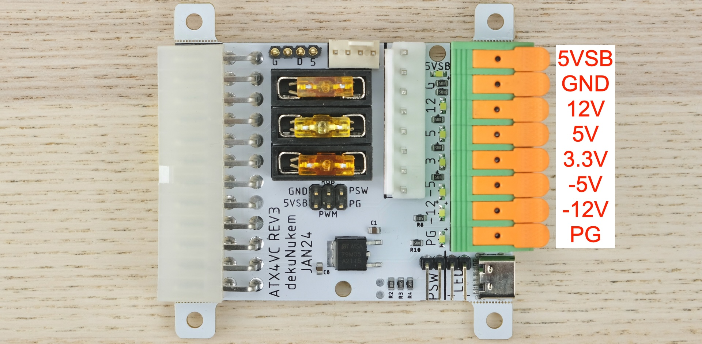
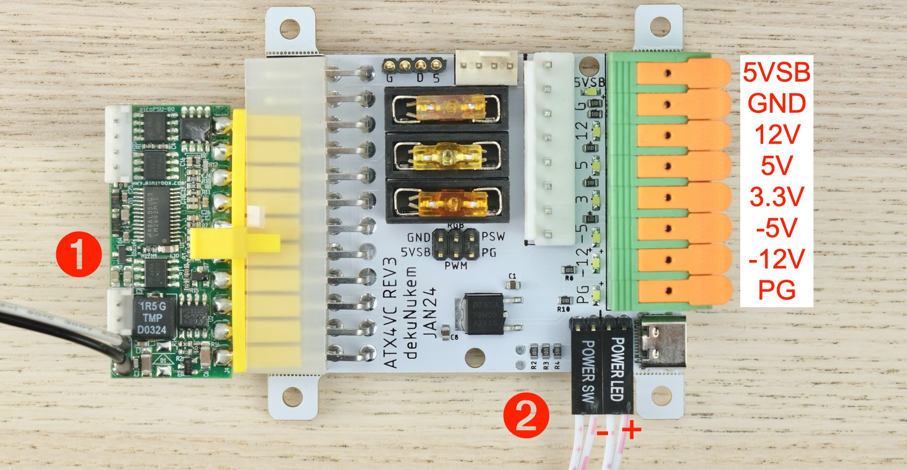
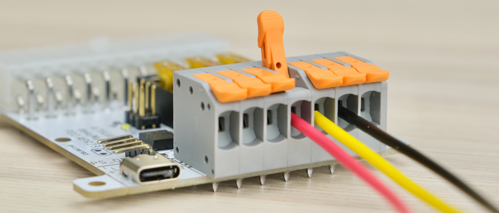
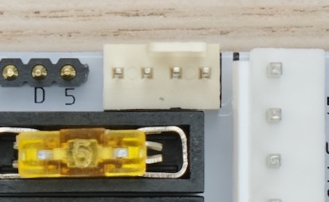

# ATX4VC: ATX Power on Retro Computers!

[Buy ATX4VC](https://www.tindie.com/products/dekuNukem/atx4vc-atx-power-on-retro-computers/) | [Discord](https://discord.gg/T9uuFudg7j) | [User Manual](#user-manual) | [Table of Contents](#Table-of-Contents)

ATX4VC lets you **use ATX power supply on vintage computers**.

It has:

* All common voltages: +12V, +5V, +3.3V, -5V, -12V.

* Toolless Lever-Actuated Terminal Block

* PC Fan Header

* USB-C and Auxiliary Power Output

* Fan speed, soft power, ARGB animation with optional MCU daughterboard.

You can use ATX4VC to:

* Replace retro computer PSUs

* Test and diagnose vintage hardware

* As general-purpose multi-voltage bench PSU

## Get ATX4VC

[Click me to get one on Tindie!](https://www.tindie.com/products/dekuNukem/atx4vc-atx-power-on-retro-computers/)

## PicoRC

Also [Check out PicoRC](https://github.com/dekuNukem/PicoRC) for **device-specific** and **lower-cost** PicoPSU adaptors.

Available for Apple II, Macintosh 128K/Plus, Macintosh SE SE/30, and more.

## Showcase

Here ATX4VC replaces the dead PSU in my IBM 5155 Portable PC, providing +12, +5, -12, and -5V.

Note the significant simplification and space/weight saving.

It also works as a multi-voltage bench PSU for testing and diagnostics.

Here it powers a Macintosh Plus motherboard with +12, +5, and -12V.

## Why / Project Goals

Power supplies are a major failure point of old computers today. Those early PSUs are heavy, inefficient, hot, and (slightly) explosive! After 40 odd years, many are not working, or worse might cause damage with out-of-spec voltages.

ATX4VC is designed to replace them with much more reliable modern ATX PSUs, and help test and diagnose vintage computers.

## Table of Contents

- [Pico PSU](#get-a-pico-psu)

- [Quick Start](#quick-start)

- [Power Button](#power-button)

- [Power Connection](#power-connection)

- [Pre-flight Checks](#pre-flight-checks)

- [Current Limit](#current-limit)

- [Fuses](#fuses)

- [Fan Headers](#fan-headers)

- [USB-C Power Output](#usb-c-power-output)

## User Manual

### Get a Pico PSU

ATX4VC works with **any ATX PSU**, but a PicoPSU is recommended due to its compact size.

* [Official website](https://www.mini-box.com/DC-DC) and [distributors](https://www.mini-box.com/site/resellers.html). Even the cheapest 80W one should be plenty.

* You can also find generic clones on eBay/Amazon/Aliexpress. They are pretty poor quality and *not that* cheap, so I strongly suggest supporting the official product.

* A power brick with **12V DC** and **center positive** 5.5x2.5mm barrel jack is needed.

* They are very popular and you might already have one. Make sure it has enough wattage.

Remember that this solution is **only as good as your PicoPSU and 12V Brick**, so don't skimp on them!

### Quick Start

* Plug in ATX connector

* Connect Power Button (left two pins)

* (Optional) Connect Power LED (right two pins, note polarity, resistor NOT needed)

The PSU should turn on, all voltage rail LEDs should light up. 

That's the gist of it! But **please do keep reading** for the complete info.

### Power Button

The power button should be latching type (aka NOT momentary).

If you **do** want to use a momentary button for soft power, use the optional [MCU daughterboard](#mcu-daughterboard).

### Power Connection

* Pinout same on terminal block and auxiliary connector.

* 5VSB = 5V Standby. Available even when PSU is off.

* Power Good: 5V when all voltages are stable and correct, 0V otherwise.

To connect a wire:

* Strip the insulation about 12mm / 0.5in.

* Lift handle, insert, press back down.

Also, make sure the conductor is thick enough!

Label the rails, vinyl stickers are available in the [product page](https://www.tindie.com/products/dekuNukem/atx4vc-atx-power-on-retro-computers/):

### Pre-flight Checks

Before powering up:

* Double check the **correct voltage terminal** is used

* Check for **dead shorts** between each voltage rail and GND, and between themselves!

Once powered up:

* Check voltage readings on each rail

Remember that ATX4VC **DOES NOT** monitor or condition PSU voltage outputs, so make sure the PSU itself is of good quality and trustworthy!

### Current Limit

* **`5 AMPS MAX`** OVER **ANY SINGLE RAIL**

* **`7 AMPS MAX`** **TOTAL CURRENT** OVER ALL RAILS

If more is needed, **tap the power directly** from a Molex connector.

See your PSU label or datasheet to see how much current it can provide:

### Fuses

Positive voltages are fused.

* USE FUSES RATED **5A OR LESS**

* **DO NOT BYPASS FUSES**

ATX4VC uses common car fuses. Regular, Mini, and low-profile Mini all will work. Simply push into the holder.

Negative rails are unfused because they are low-current (around 200mA), and built-in protection is adequate.

### Fan Headers

A PC Fan header is available. You can plug in any standard 12V PC fan, both 3-Pin and 4-Pin.

By default it will run at full speed.

PWM speed adjustment and temperature probe is supported on optional [MCU daughterboard](#mcu-daughterboard).

### USB-C Power Output

USB-C connectors are available for powering external devices.

The one on ATX4VC itself is on regular 5V rail, can provide full current.

The one on MCU daughterboard provides 5V standby, lower current but always available.

Those ports are **output only**, don't try to backfeed them with another powered device.

## MCU Daughterboard

Under construction ...

## USB Firmware Update

Under construction ...

## Table of Contents (again)

- [Pico PSU](#get-a-pico-psu)

- [Quick Start](#quick-start)

- [Power Button](#power-button)

- [Power Connection](#power-connection)

- [Pre-flight Checks](#pre-flight-checks)

- [Current Limit](#current-limit)

- [Fuses](#fuses)

- [Fan Headers](#fan-headers)

- [USB-C Power Output](#usb-c-power-output)

## Questions or Comments?

Feel free to ask in official [Discord Chatroom](https://discord.gg/T9uuFudg7j), raise a [Github issue](https://github.com/dekuNukem/ATX4VC/issues), or email `dekunukem` `gmail.com`!

