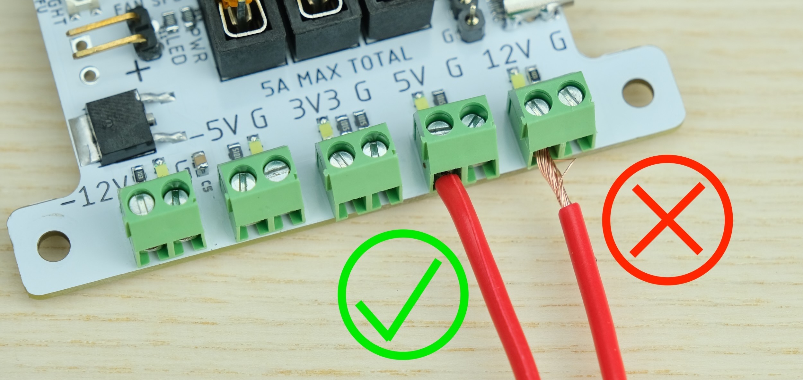
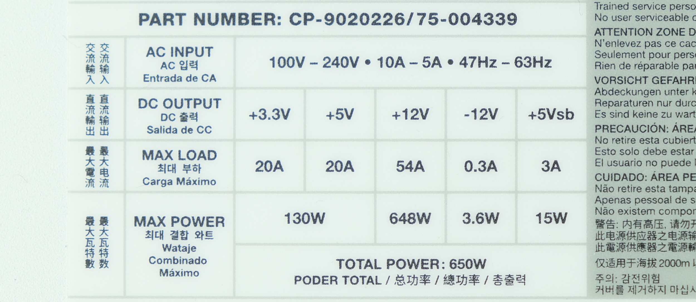
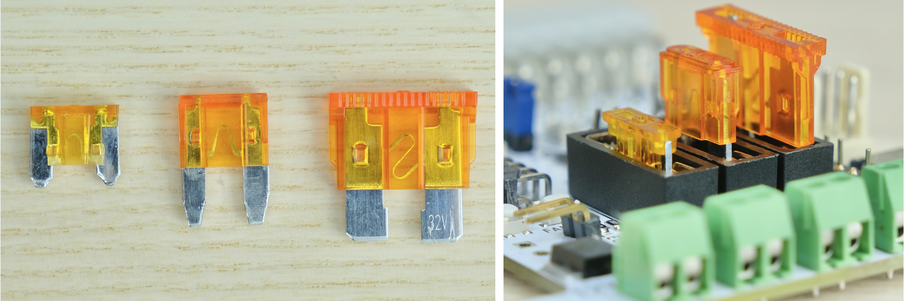
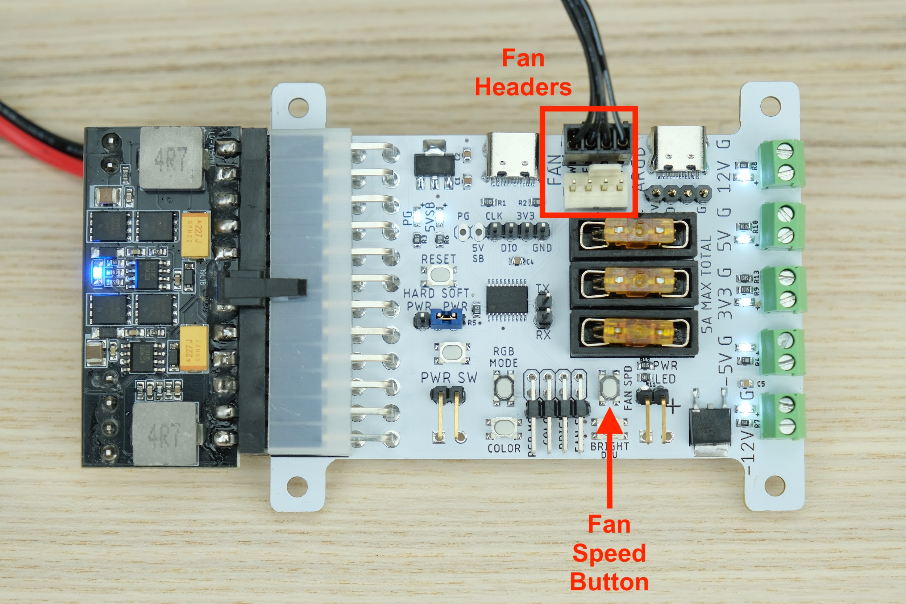

# ATX4VC: ATX Power on Retro Computers!

ATX4VC is an all-in-one controller for **using ATX power supply on vintage computers**.

ATX4VC combines many convenient features in one place:

* All common voltages: +12V, +5V, +3.3V, -5V, -12V. Fused.

* Headers for soft power button and power LED

* **Two** 4-pin PWM fan headers. Manual fan speed or via temperature probe.

* **Two** Addressable RGB(ARGB) headers

* **Two** USB-C ports for power output and firmware update

ATX4VC can be used to:

* Replace retro computer power supplies

* Add cooling and lighting upgrades

* Test and diagnose vintage hardware

* As general-purpose multi-voltage bench PSU

## Showcase

ATX4VC supports **full-size ATX PSU**, seen here (lower right) in my RGBeeb project, powering a BBC Micro motherboard with +5V and -5V.

It provides a clean interface for PSU control, RGB animation, and powering additional devices via USB-C ports.

[Read more about the build here.](https://github.com/dekuNukem/RGBeeb)

But of course, a **pico ATX PSU** makes more sense due to its compact size. 

Here it replaces the failed PSU in my Osborne 1, providing +12V and +5V.

I even took it to a coffee shop and wrote most of this very document! But that's the story for another day.

You can also just use it as a multi-voltage bench PSU for testing and diagnostics.

Here it powers a Macintosh Plus motherboard with +12V, +5V, and -12V.

## Why / Project Goals

Power supplies are a major failure point of old computers today. Those early PSUs are heavy, inefficient, runs hot, and (often) explosive! After 40 odd years, many are not working, or worse might cause damage with out-of-spec voltages.

ATX4VC is designed to replace them with much more reliable modern ATX power supplies, and as a tool to help test and diagnose vintage computers. 

## User Manual

### Quick Start

* Make sure the jumper is in "soft power" setting (right two pins)

* Plug in ATX connector, and turn on the PSU.

* Press the power button

The PSU should turn on and all voltage rail LEDs should light up. 

That's the gist of it! But **please do keep reading** for the complete info.

### Power Button and Power LED

You can use the built-in power button, or connect an additional button to the header.

Any momentary button will do, such as the one in PC cases.

You can also add a power LED to indicate PSU is on. Be ware of polarity.

The power LED is connected to fused 5V rail. **No need for external resistors**. A 2.5K resistor is built-in.

### Power Connection

Observe the voltage on each terminal block.

Loosen the screw, insert the cable into the hole, and tighten it again.

Don't leave conductor exposed! Trim it to prevent shorts.

### Current Limit

ATX4VC has current limit as follows:

* **`5 AMPS MAX`** OVER **ANY SINGLE RAIL**

* **`7 AMPS MAX`** **TOTAL CURRENT** ACROSS ALL RAILS

If more is needed, **tap the power directly** from a Molex connector.

See your PSU label or datasheet to see how much current it can provide:

### Fuses

+12V, +5V, and +3.3V are fused.

* USE FUSES RATED **5A OR LESS**

* **DO NOT BYPASS FUSES**

ATX4VC uses commonly available car fuses. Regular, Mini, and low-profile Mini all work, just push it into the header.

Negative rails are not fused because they are low-current (around 200mA), and built-in protection is adequate.

### Fan Headers

Two PWM Fan headers are available. You can plug in standard 12V PC fans, both 3-Pin and 4-Pin.

Press `FAN SPD` button to change speed manually.

Speed control only available on 4-Pin PWM fans. 3-Pin fan will always run at full speed.

### Temperature Probe

ATX4VC supports the DS18B20 digital temperature probes. They are inexpensive and very popular in Arduino projects.

Beware of fake counterfeits! Best to get them from a reputable distributor like [Sparkfun](https://www.sparkfun.com/products/11050) or [Adafruit](https://www.adafruit.com/product/381).

Connect to the headers, match the pinout.

Then **HOLD** FAN SPD button to activate fan curve. The user LED should stay on for 1 second then turn off.

If Temperature proble is not detected, the user LED will flash 5 times.

### Addressable RGB (ARGB)

Two standard ARGB headers are available. Simply plug them in. Up to 100 ARGB LEDs are supported.

Use **RGB MODE** button to change animation type, **BRIGHT** and **COLOUR** button to adjust brightness and colour.

Hold the button to cycle through faster.

## Mounting Options and Dimension

ATX4VC is compatible with **2.5 inch PC drive bay**, and is compact enough to fit in many vintage computers.

Use M3 screws and nuts. Dimension drawing below:

## Additional Features

### Hard Power

Move the jumper to the left for hard power.

This shorts PS_ON pin to GND, and turns on PSU immediately when power is applied.

### USB-C Power Output

Two USB-C ports can be used for 5V power output.

The one on the left is connected to **5V Standby**, available when PSU is off (but plugged in), can provide around 1A of current.

One on the right gets **fused 5V**, only available when PSU is on, but can provide more current.

### RGBA over USB

This is a remnant of my [RGBeeb project](https://github.com/dekuNukem/RGBeeb), which ARGB signal is transmitted over USB-C for a cleaner look.

5V and GND is the same, and ARGB signal is on D+ line. If you want to use it, short the jumper with some solder.

### Additional Headers

There are also some headers for development purposes, no need to worry about them, but here are the details if you're curious.

## USB Firmware Update

TURN OFF AND UNPLUG ATX PSU BEFORE STARTING.