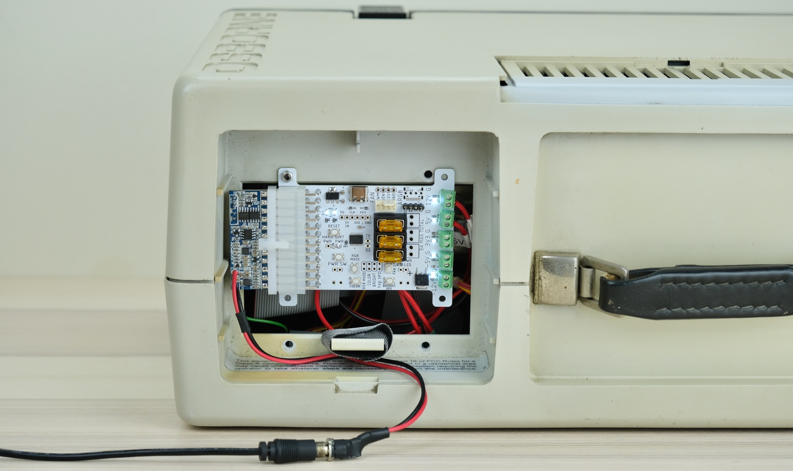
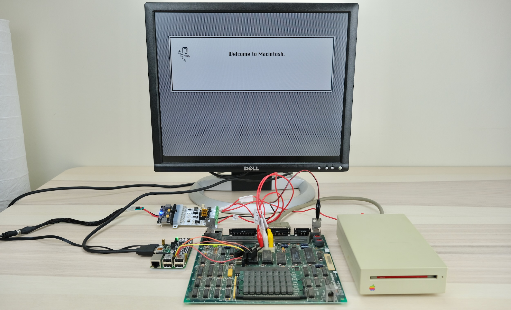
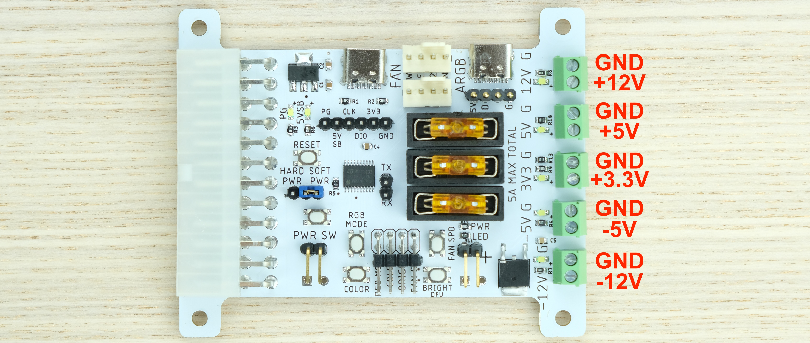
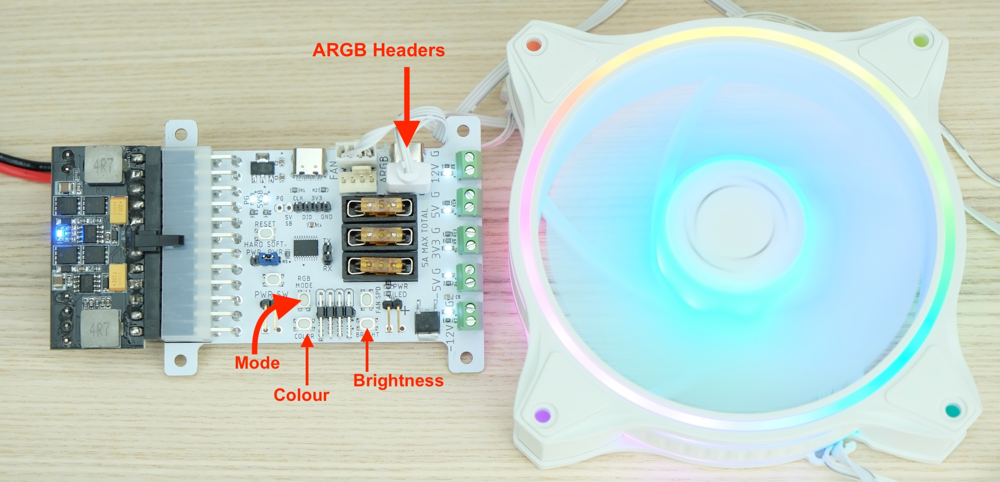
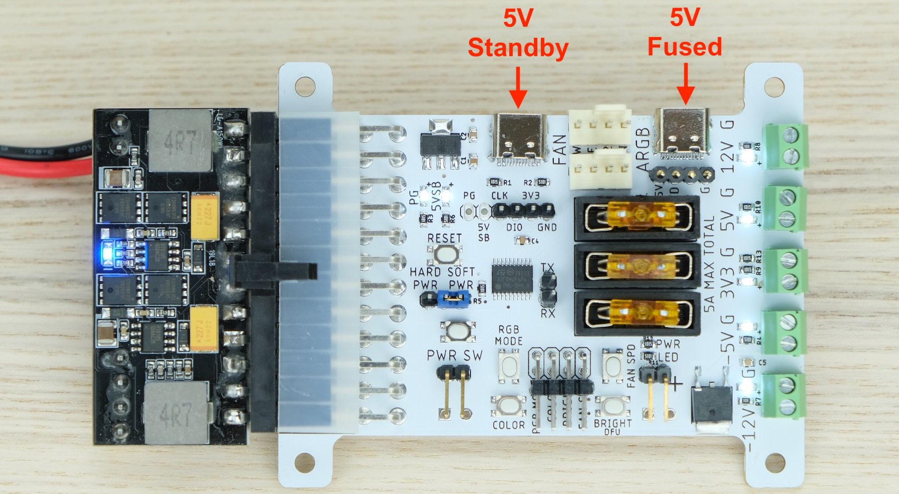
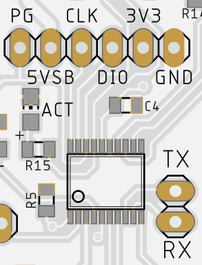

# ATX4VC: ATX Power on Retro Computers!

[Buy ATX4VC](https://www.tindie.com/products/dekuNukem/atx4vc-atx-power-on-retro-computers/) | [Discord](https://discord.gg/T9uuFudg7j) | [User Manual](#user-manual) | [Table of Contents](#Table-of-Contents)

ATX4VC lets you **use ATX power supply on vintage computers**.

It has:

* All common voltages: +12V, +5V, +3.3V, -5V, -12V.

* Power button and LED headers

* PC fan headers with PWM and temp probe support

* Addressable RGB (ARGB) headers

* USB-C power output and firmware update

ATX4VC can be used to:

* Replace retro computer PSUs

* Add cooling and lighting upgrades

* Test and diagnose vintage hardware

* As general-purpose multi-voltage bench PSU

## Get ATX4VC

[Click me to get one on Tindie!](https://www.tindie.com/products/dekuNukem/atx4vc-atx-power-on-retro-computers/)

## PicoRC

[Check out PicoRC](https://github.com/dekuNukem/PicoRC) for **device-specific** and **lower-cost** PicoPSU adaptors.

Available for Apple II, Macintosh 128K/Plus, Macintosh SE SE/30, and more.

## Showcase

A **pico ATX PSU** is a perfect match due to its compact size. 

Here it replaces the failed PSU in my Osborne 1, providing +12 and +5V.

It also functions as a multi-voltage bench PSU for testing and diagnostics.

Here it powers a Macintosh Plus motherboard with +12, +5, and -12V.

## Why / Project Goals

Power supplies are a major failure point of old computers today. Those early PSUs are heavy, inefficient, hot, and (slightly) explosive! After 40 odd years, many are not working, or worse might cause damage with out-of-spec voltages.

ATX4VC is designed to replace them with much more reliable modern ATX PSUs, and help test and diagnose vintage computers.

## Table of Contents

[Quick Start Guide](#Quick-Start)

[Power Button and Power LED](#Power-Button-and-Power-LED)

[Power Connection](#Power-Connection)

[Current Limit](#Current-Limit)

[Fuses](#Fuses)

[Fan Headers](#Fan-Headers)

[Temperature Probe](#Temperature-Probe)

[Addressable RGB (ARGB)](#Addressable-RGB-ARGB)

[USB-C Power Output](#USB-C-Power-Output)

[Dimension Drawings](#Dimension-Drawings)

[Hard Power](#Hard-Power)

[RGBA over USB](#RGBA-over-USB)

[Additional Headers](#Additional-Headers)

[USB Firmware Update](#USB-Firmware-Update)

## User Manual

### Get a Pico PSU

ATX4VC works with **any standard ATX PSU**, but a PicoPSU is recommended due to its compact size.

* [Official website](https://www.mini-box.com/DC-DC) and [distributors](https://www.mini-box.com/site/resellers.html). Even the cheapest 80W one should be plenty.

* You can also find generic ones on eBay/Amazon/Aliexpress by searching `Pico ATX`. They are *not that* cheap, so I strongly suggest supporting the high-quality official products.

* A power brick with **12V DC** and **center positive** 5.5x2.5mm barrel jack is needed.

* They are very popular and you might already have one. Make sure it has enough wattage.

Remember that this solution is **only as good as your PicoPSU and 12V Brick**, so don't skimp on them!

### Quick Start

* Make sure the jumper is in "soft power" setting (right two pins)

* Plug in ATX connector

* Press the power button

The PSU should turn on, all voltage rail LEDs should light up. 

That's the gist of it! But **please do keep reading** for the complete info.

### Power Button and Power LED

You can use the built-in power button, or connect an external button to the header.

You can also add an external power LED. Be ware of polarity. **No need for external resistors**. A 2.5K resistor is built-in.

### Power Connection

Observe the voltage on each terminal block.

* Strip the cable

* Loosen screw

* Insert into hole

* **hold the terminal block steady with your finger** while tightening it back up

* Don't leave conductor exposed to prevent shorts.

Also, make sure the conductor is thick enough!

Alligator clips are handy, but many have very thin wires. If so, you can solder a thicker cable to it.

Label the rails, vinyl stickers are available in the [product page](https://www.tindie.com/products/dekuNukem/atx4vc-atx-power-on-retro-computers/):

### Pre-flight Checks

Before powering up:

* Double check the **correct voltage terminal** is used

* Check for **dead shorts** between each voltage rail and GND, and between themselves!

Once powered up:

* Check voltage readings on each rail

Remember that ATX4VC **DOES NOT** monitor or condition PSU voltage outputs, so make sure the PSU itself is of good quality and trustworthy!

### Current Limit

ATX4VC has current limit as follows:

* **`5 AMPS MAX`** OVER **ANY SINGLE RAIL**

* **`7 AMPS MAX`** **TOTAL CURRENT** OVER ALL RAILS

If more is needed, **tap the power directly** from a Molex connector.

See your PSU label or datasheet to see how much current it can provide:

### Fuses

+12V, +5V, and +3.3V are fused.

* USE FUSES RATED **5A OR LESS**

* **DO NOT BYPASS FUSES**

ATX4VC uses common car fuses. Regular, Mini, and low-profile Mini all will work. Simply push into the holder.

Negative rails are not fused because they are low-current (around 200mA), and built-in protection is adequate.

### Fan Headers

Two PWM Fan headers are available. You can plug in standard 12V PC fans, both 3-Pin and 4-Pin.

Press `FAN SPD` button to cycle through different speeds:

| Fan Speed (%) |                     Note                    |
|:-------------:|:-------------------------------------------:|
|       0       | May or may not stop depending on fan itself |
|       20      |                                             |
|       40      |                                             |
|       55      |                                             |
|       65      |                                             |
|       80      |                                             |
|       90      |                                             |
|      100      |                3 fast blinks                |
|      Auto     |                5 slow blinks                |

Speed control only available on 4-Pin fans. 3-Pin fan will always run at full speed.

### Temperature Probe

ATX4VC supports the DS18B20 temperature sensor. They are inexpensive and very popular in Arduino projects.

The cheap ones on ebay are almost certainly counterfeits! They'll still work, but readings are noisier and less accurate.

Try a reputable distributor like [Sparkfun](https://www.sparkfun.com/products/11050), [Adafruit](https://www.adafruit.com/product/381), Mouser, or Digikey.

Connect the headers. Usually VCC is red, GND is black, DATA is yellow.

Press **FAN SPD** button until the user LED `slowly blinks 5 times`. Now fan speed will depend on the temperature reading.

The fan starts to speed up at 25°C, and reaches full speed at 50°C. If probe is not detected, it will run at full speed.

You can use a heat gun and air duster to test out the probe.

### Addressable RGB (ARGB)

Two standard ARGB headers are available. Simply plug them in. Up to 100 ARGB LEDs are supported.

Use **RGB MODE** button to change animation type, **BRIGHT** and **COLOUR** button to adjust brightness and colour.

Hold the button to cycle through faster.

### USB-C Power Output

Two USB-C connectors are available for powering external devices.

The left port provides 5V Standby, which is active even when PSU is off. Although max current is limited (typically 1 to 2 Amps)

The right port is on regular 5V rail. It can provide more current, but only available when PSU is on.

Those ports are **output only**, don't try to backfeed them with another powered device.

### Dimension Drawings

ATX4VC is compatible with **2.5 inch PC drive bay**, and is compact enough to fit in most vintage computers.

Use M3 screws and nuts. Dimension drawing below:

## Additional Features

### Hard Power

Move the jumper to the left for hard power.

This shorts PS_ON pin to GND, and turns on PSU immediately when plugged in.

You can also wire up a toggle / latching switch to the left two pins to control the PSU directly.

### Button Header

External momentary buttons can be connected to adjust various settings:

### Additional Headers

A few more signals are available on headers.

|  Pin |    Function   | Note                                             |
|:----:|:-------------:|--------------------------------------------------|
|  PG  |   Power Good  | High (+5V) when output is correct and stable     |
| 5VSB |   5V Standby  | Available when PSU is off, max current 2A usually|
|  CLK |     SWCLK     | For microcontroller (MCU) programming            |
|  DIO |     SWDIO     | For MCU programming                  			  |
|  3V3 |   3.3V Power  | Regulated from 5VSB for MCU power, 500mA max     |
|  GND |     Ground    |                                                  |
|  TX  | UART Transmit | Prints some debugging messages @ 115200bps       |
|  RX  |     Unused    |                                                  |

## USB Firmware Update

TURN OFF AND UNPLUG ATX PSU BEFORE STARTING.

Under construction ...

## Table of Contents (again)

[Quick Start Guide](#Quick-Start)

[Power Button and Power LED](#Power-Button-and-Power-LED)

[Power Connection](#Power-Connection)

[Current Limit](#Current-Limit)

[Fuses](#Fuses)

[Fan Headers](#Fan-Headers)

[Temperature Probe](#Temperature-Probe)

[Addressable RGB (ARGB)](#Addressable-RGB-ARGB)

[USB-C Power Output](#USB-C-Power-Output)

[Dimension Drawings](#Dimension-Drawings)

[Hard Power](#Hard-Power)

[RGBA over USB](#RGBA-over-USB)

[Additional Headers](#Additional-Headers)

[USB Firmware Update](#USB-Firmware-Update)

## Questions or Comments?

Feel free to ask in official [Discord Chatroom](https://discord.gg/T9uuFudg7j), raise a [Github issue](https://github.com/dekuNukem/ATX4VC/issues), or email `dekunukem` `gmail.com`!

